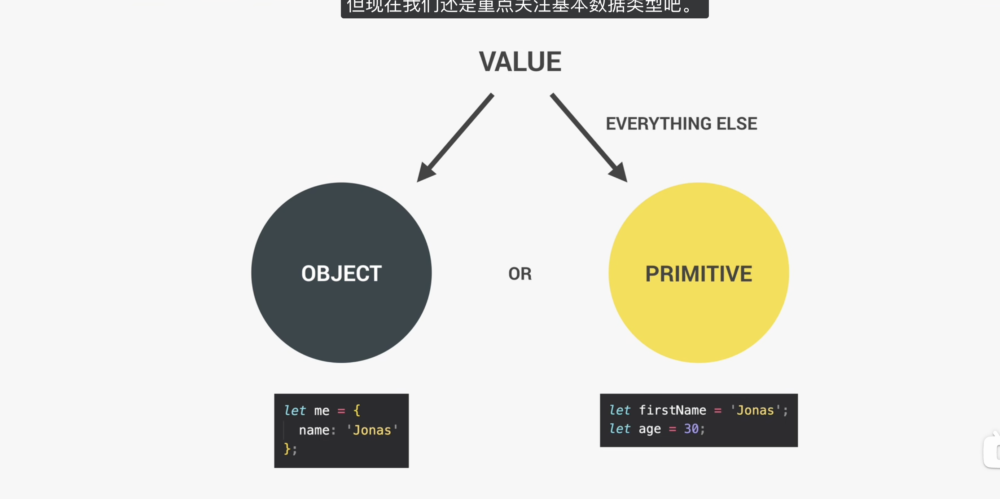

# Basics


## 1.变量类型

primitive data types（基本数据类型）有7种.



动态类型，自动确定数据类型。

## 2.声明变量的三种方式

`var`、`let` 和 `const` 都是 JavaScript 中用来声明变量的关键字，但在现代开发中，它们的行为有显著差异。你可以通过以下 5 个核心维度来区分它们：

1. 作用域（Scope）

- **`var`** 是**函数作用域**（或全局作用域）。只要在函数内声明，整个函数都能访问；如果在代码块（如 `if` 或 `for` 的 `{}`）中声明，代码块外部依然可以访问 。greatfrontend+1
- **`let` 和 `const`** 是**块级作用域**。它们只在最近的一对花括号 `{}` 内部有效，出了花括号就无法访问 。cloud.tencent+1

2. 变量提升与暂时性死区（Hoisting & TDZ）

- **`var`** 会发生变量提升，并在初始化前默认赋值为 `undefined`。因此，在声明之前打印它，结果是 `undefined`，不会报错 。freecodecamp+1
- **`let` 和 `const`** 也会提升，但**不会被初始化**。在声明语句执行之前，它们处于“暂时性死区”（TDZ），此时尝试访问会直接抛出 `ReferenceError` 报错 。explainthis+1

3. 重复声明（Redeclare）

- **`var`** 允许在同一个作用域内多次声明同一个变量，后声明的会覆盖前面的 。[[greatfrontend](https://www.greatfrontend.com/zh-CN/questions/quiz/what-are-the-differences-between-variables-created-using-let-var-or-const)]
- **`let` 和 `const`** **严禁**在同一个作用域内重复声明同一个变量，否则会抛出语法错误（`SyntaxError`） 。freecodecamp+1

4. 重新赋值与初始化（Reassign & Initialization）

- **`var` 和 `let`**：可以在声明后随意重新赋值。声明时也可以不赋初始值（默认是 `undefined`） 。[[greatfrontend](https://www.greatfrontend.com/zh-CN/questions/quiz/what-are-the-differences-between-variables-created-using-let-var-or-const)]
- **`const`**：专门用于声明常量。**必须在声明的同时赋初始值**，且声明后**绝对不允许被重新赋值**（如果值是对象或数组，其内部的属性或元素可以修改，但变量的指向不能变） 。explainthis+1

5. 全局对象属性（Global Object Property）

- 在浏览器最外层（全局作用域）使用 **`var`** 声明的变量，会自动成为 `window` 对象的属性（如 `window.a`） 。juejin+1
- 使用 **`let` 和 `const`** 在全局声明的变量，不会挂载到 `window` 对象上，这能有效防止意外污染全局环境 。[[juejin](https://juejin.cn/post/6925641096152399880)]

### 总结建议

现代 JavaScript 开发的标准最佳实践是：**默认使用 `const`**；只有当确定这个变量的值后续需要被改变（比如循环计数器 `i`）时才使用 **`let`**；并且**完全弃用 `var`** 。[[greatfrontend](https://www.greatfrontend.com/zh-CN/questions/quiz/what-are-the-differences-between-variables-created-using-let-var-or-const)]

## 3.运算符

这里的运算符较为简单，所以我直接写一个比较重要的就是运算符的优先级。

自己看链接吧，https://developer.mozilla.org/zh-CN/docs/Web/JavaScript/Reference/Operators/Operator_precedence。其实我觉得只需要用的时候查一查即可。

`??` 是 **nullish coalescing operator**，中文一般叫：

### **空值合并运算符**

它的作用是：

> **当左边是 `null` 或 `undefined` 时，返回右边。**
> 否则返回左边。

```js
console.log(0 || '默认');    // '默认'
console.log(0 ?? '默认');    // 0

console.log('' || '默认');   // '默认'
console.log('' ?? '默认');   // ''

console.log(false || '默认'); // '默认'
console.log(false ?? '默认'); // false

console.log(null || '默认');  // '默认'
console.log(null ?? '默认');  // '默认'

console.log(undefined || '默认'); // '默认'
console.log(undefined ?? '默认'); // '默认'
```


## 4.字符串简单应用

```javascript
// 字符串的使用
const firstName = "zkx";
const year = 2026;
const birthYear = 2006;
const job = "teacher";

const jonas =
  "I'm" + firstName + ",a" + (year - birthYear) + "year old" + job + "!";
//用反引号去写字符串
const jonasNew = `I'm ${firstName},a ${year - birthYear} year old ${job}`;
console.log(jonasNew);
//多行字符串

console.log(`Just a regular string...`);

console.log(
  "String with \n\
    multiple\n\
    lines",
);

console.log(`String
    multiple
    lines`);
```

## 5.类型转换

```javascript
//type conversion 类型转换
const inputYear = "1991";
console.log(Number(inputYear), inputYear);
console.log(Number(inputYear) + 18);

//NaN:“无效的数字结果”,可以理解为number 类型中的一个特殊值，表示无效的数值结果
console.log(Number("Jonas"));
console.log(typeof NaN);

console.log(String(23), 23);

//type coercion 类型强制
/*
+：如果涉及字符串，倾向于拼接
-、*、/：倾向于把值转成数字再运算
*/
console.log("I'm " + 23 + "years old");
console.log("23" - "10" - 3);
console.log("23" / "2");

```

一般就是Number,String,Bool三者转换。


## 6. `==` 与 `===` 的区别

##### 1. `==`：宽松相等

```js
a == b
```

意思是：

> **比较时会先进行类型转换，再判断值是否相等**

也就是说，如果两边类型不同，JavaScript 会尝试“强行拉到一个频道”再比。

例子

```js
console.log(18 == '18'); // true
```

因为字符串 `'18'` 会先转成数字 `18`，然后再比较。

------

##### 2. `===`：严格相等

```js
a === b
```

意思是：

> **不进行类型转换，类型和值都必须相同，才返回 true**

例子

```js
console.log(18 === '18'); // false
```

因为：

- 左边是 `number`
- 右边是 `string`

类型不同，所以直接 `false`。

------

#### 总结

- `==` ：**会自动类型转换后再比较**
- `===`：**不会类型转换，要求类型和值都相同**

------

对比例子

```js
console.log(1 == '1');   // true
console.log(1 === '1');  // false

console.log(true == 1);  // true
console.log(true === 1); // false

console.log(null == undefined);   // true
console.log(null === undefined);  // false
```

------

为什么通常推荐用 `===`

因为 `==` 会发生**隐式类型转换**，容易出现意料之外的结果。

比如：

```js
console.log('' == 0);      // true
console.log(false == 0);   // true
console.log('' == false);  // true
```

这就很邪门，像 JavaScript 在偷偷搞小动作。

所以实际开发中通常建议：

> **优先使用 `===` 和 `!==`**
> 这样判断更清晰、更安全。

------

笔记版总结

#### `==`

- 宽松相等
- 会进行类型转换
- 只比较转换后的值
- 容易出现隐式转换问题

#### `===`

- 严格相等
- 不会进行类型转换
- 类型和值都必须相同
- 开发中更推荐使用

------

最后一句可直接背

> **`==` 比较时会自动转换类型，`===` 不会；实际开发优先使用 `===`。**

再给你一个超适合记在旁边的小提醒：

```js
 prompt()` 得到的通常是字符串，所以和数字比较时要特别注意 `===`
 //这个是输入
```

比如：

```js
const age = prompt('age?');
console.log(age === 18); // false
console.log(Number(age) === 18); // true
```

## 7.Boolean

示例代码

```javascript

//5 falsy values:0 , '' , undefined , null ,NaN

console.log(Boolean(0));
console.log(Boolean(undefined));
console.log(Boolean("Jonas"));
console.log(Boolean({}));
console.log(Boolean(""));

let height = 0;
if (height) {
  console.log("ya! Height is defined");
} else {
  console.log("Height is UNDeFINED");
}

```

