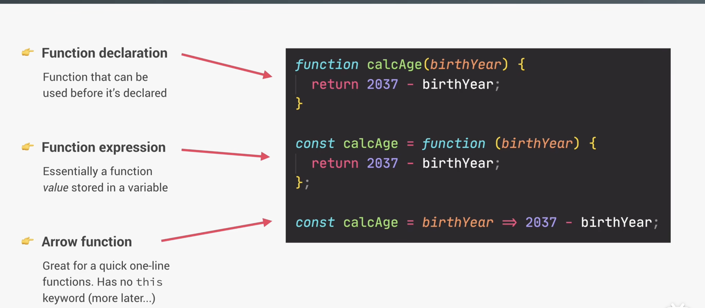
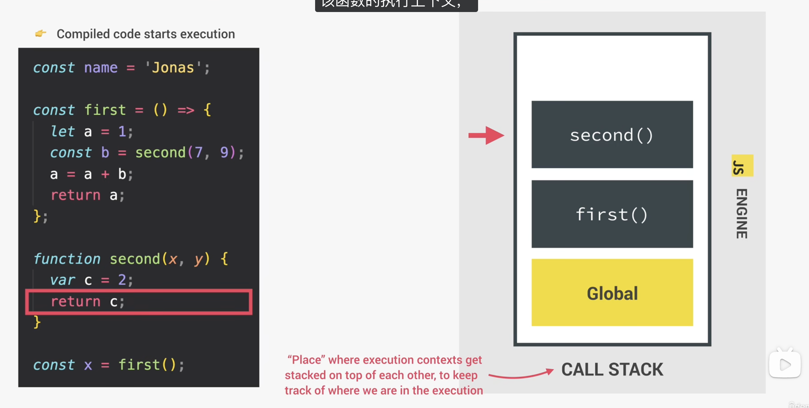

# 02 Functions

## 1.函数的三种声明方式



```javascript
//Function declation 函数声明可以提前调用，但是函数表达式不可以
const age1 = calcAge1(1991);
function calcAge1(birthYear) {
  return 2037 - birthYear;
}
console.log(age1);
//Fcnction expression 函数表达式
const Age2 = function (birthday) {
  return 2037 - birthday;
};
console.log(Age2(22));

//Arrow function

//这个参数少一点
const calcAge3 = (birthYear) => 2037 - birthYear;

const age3 = calcAge3(1991);
console.log(age3);

//参数多的

const yearsUntilRetirement = (birthYear, firstName) => {
  const age = 2037 - birthYear;
  const retirement = 65 - age;
  //return retirement
  return `${firstName} retires in ${retirement} years`;
};

console.log(yearsUntilRetirement(1991, "Jonas"));
console.log(yearsUntilRetirement(1980, "Bob"));

```

## 2.箭头函数/arguments（重点，特意拿出来）

以下代码还涉及到**this关键字**，我们将在之后会介绍到。

示例代码：

```js
'use strict';

//scope in practice

//Regular Functions vs Arrow Functions

const jonas = {
  firstName: 'zkx',
  year: 2006,

  //method:this = 调用该方法的对象
  calcAge: function () {
    console.log(this);
    console.log(2037 - this.year);
    /*
    const isMillenial = () => {
      console.log(this);
      console.log(this.year >= 2006 && this.year <= 1996);
    };
    isMillenial();
    */
  },
  //Arrow Function
  /*
  因为箭头函数没有自己的 this，它不会因为：
    jonas.greet();
    就自动把 this 变成 jonas。
    它只会去它定义时的外层作用域找 this。
    所以这里的 this 通常不是 jonas。
  */
  greet: () => {
    console.log(this);
    console.log(`Hey ${this.firstName}`);
  },
};
// 普通函数：看调用方式
// 箭头函数：看外层 this
jonas.greet(); //运行结果 {} undefine 第一个结果也是全局，我用的是nvm环境，所以输出的是{}

//普通函数的两种调用方式，第一种还是this=undefine，第二种复合
// const f = jonas.calcAge;
// f();
jonas.calcAge();

//arguments keyword 类数组对象 它保存的是这次调用时传进来的所有实参,不是一个真正的数组
const addExpr = function (a, b) {
  console.log(arguments);
  return a + b;
};

addExpr(2, 5);
addExpr(2, 5, 8, 12);

// const addArrow = (a, b) => {
//   console.log(arguments);
//   return a + b;
// };
//现在更加推荐用这个...args，普通函数和箭头函数都能用，是真正的数组。
const addArrow = (...args) => {
  console.log(args);
  return args[0] + args[1];
};

addArrow(2, 5, 8);
addArrow(2, 5, 8);

```

对于**普通函数执行上下文**，常说有：

1. Variable Environment
2. Scope chain
3. `this`

并且普通函数通常还能访问：

- `arguments`

但**箭头函数是例外**：

- 没有自己的 `arguments`
- 没有自己的 `this`

所以图里才专门标出来：

> **NOT in arrow functions**

箭头函数的特殊点

箭头函数：
- 有自己的参数（parameters）
- 没有自己的 arguments 对象
- 没有自己的 this
- this 会继承外层作用域的 this

注意：
“没有自己的 arguments” 不等于 “不能传参数”。

例如：
```js
const add = (a, b) => a + b;
```

这里 a 和 b 就是箭头函数自己的参数。

如果需要获取不定数量参数，可以用 rest parameter：

```javascript
const fn = (...args) => {
  console.log(args);

};

```

一句话总结

> **箭头函数不是不能用参数，而是没有普通函数那种自动生成的 `arguments` 和 `this`。**

你下一步最值得问的是：

**“普通函数和箭头函数到底什么时候该用哪个？”**  
这个在前端里非常常用。


