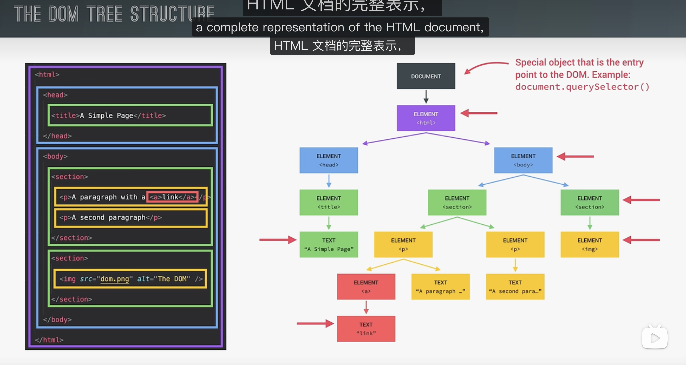

# 04 DOM and Mini Projects

## 1.DOM

DOM 是浏览器提供的一套接口（API），JavaScript 可以用它来操作网页。

浏览器会把 HTML 解析成 DOM 树。
JavaScript 可以通过 DOM 访问和修改页面元素，
比如修改文本、属性、结构等。

JavaScript 也可以通过修改 style、class 等方式影响元素样式，
从而间接控制 CSS 效果。

所以可以粗略理解为：
JS 通过 DOM 操作页面内容，并影响页面样式。

## 2.项目

### 2.1Guss_My_Number

看本目录下

### 2.2Modal

### 2.3Pig-name

