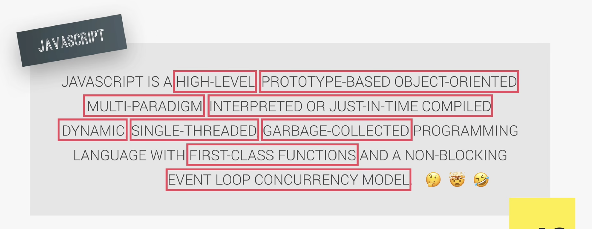
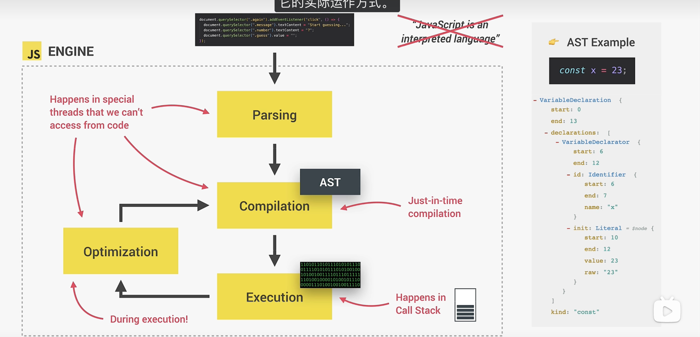
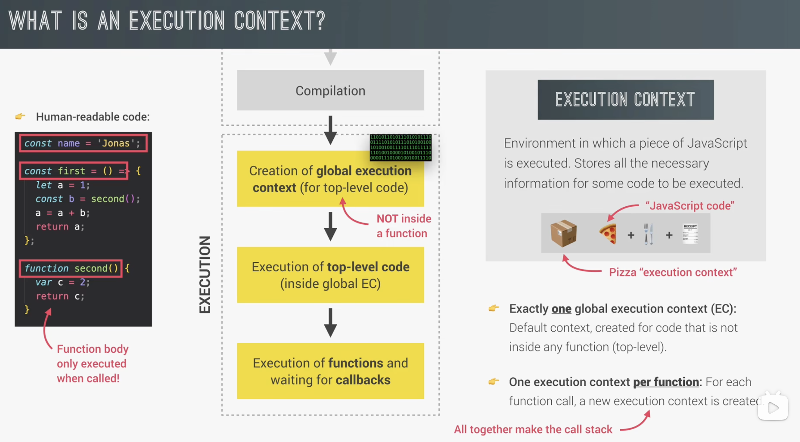
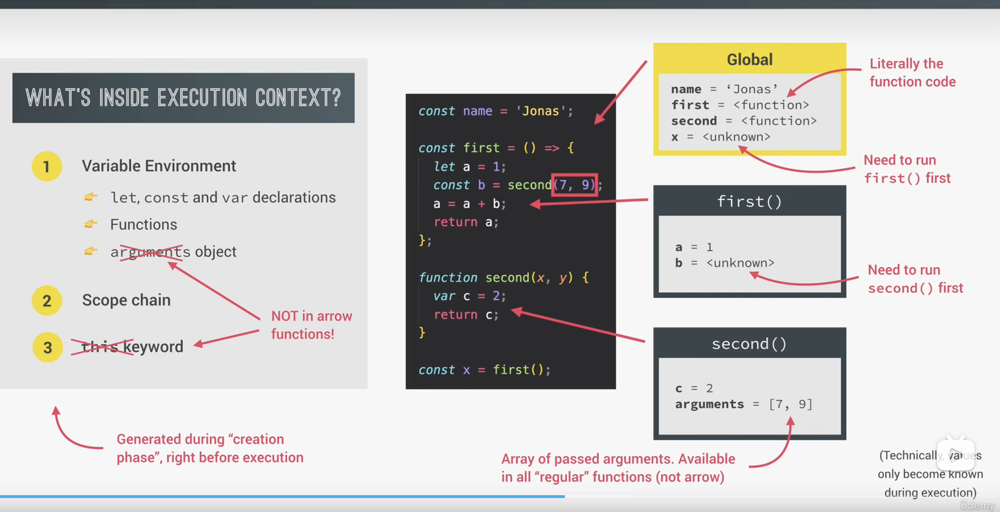

# 05 Engine and Execution Context

# javascrip高级概念



1. **High-Level (高级语言)**

JS 不需要你手动管理内存（比如 C 语言中的 `malloc`）。它提供了很高的抽象层，开发者只需关注逻辑，底层的硬件交互由引擎完成。

2. **Prototype-Based Object-Oriented (基于原型的面向对象)**

不同于 Java 这种基于类（Class-based）的语言，JS 的对象直接从其他对象继承属性。

- **关键点：** 虽然现在有 `class` 语法糖，但其底层依然是 **原型链 (Prototype Chain)** 机制。

3. **Multi-Paradigm (多范式)**

JS 非常灵活，它不强迫你使用某种编程风格：

- **命令式/过程式：** 传统的按步骤执行。
- **面向对象 (OOP)：** 使用对象和继承。
- **函数式 (FP)：** 将函数作为主要构建块，强调纯函数和不可变性。

4. **Interpreted or Just-In-Time Compiled (解释型或即时编译)**

JS 代码不是预先编译成机器码，而是在运行时由浏览器引擎（如 Chrome 的 V8）边解释边执行，或者通过 **JIT (Just-In-Time)** 技术将热点代码即时编译以提升速度。

5. **Dynamic (动态类型)**

变量不需要声明类型。同一个变量可以先存数字，再存字符串。

- `let x = 10; x = "hello";` 在 JS 中是完全合法的。

6. **Single-Threaded & Event Loop (单线程与事件循环)**

这是 JS 最独特的地方。JS 引擎一次只能执行一个任务（单线程）。为了处理耗时操作（如网络请求）而不导致页面卡死，它使用了 **事件循环 (Event Loop)**。

- **Non-blocking (非阻塞)：** 异步操作会被挂起，执行完后通过回调或 Promise 回到主线程。

7. **Garbage-Collected (垃圾回收)**

引擎会自动识别不再使用的内存并进行清理。你不需要像在某些底层语言中那样手动释放变量占用的空间。

8. **First-Class Functions (一等公民函数)**

函数在 JS 中被视为变量：

- 可以作为参数传递给另一个函数。
- 可以作为函数的返回值。
- 可以赋值给变量。

## 1.javascrip运行原理



可以，这张图你可以这样记。它表达的核心不是“JavaScript 是纯解释型语言”，而是：

> **现代 JavaScript 会先解析，再编译，再执行，而且执行过程中还会持续优化。**
> 所以它更准确地说是：**即时编译（JIT, Just-In-Time）语言**，不是传统意义上单纯的解释型语言。

------

#### 1.整体理解

当我们写下 JavaScript 代码后，代码不会直接“原样执行”，而是会经过 JavaScript 引擎的一套处理流程：

```txt
源代码 → Parsing（解析）→ Compilation（编译）→ Execution（执行）→ Optimization（优化）
```

这也是为什么图里把 **“JavaScript is an interpreted language”** 划掉了。
因为现代 JavaScript 引擎并不是“边读边逐行解释”这么简单。

------

#### 2. Parsing（解析）

作用

引擎先读取 JavaScript 源代码，检查语法是否正确。

比如：

```js
const num = 10;
```

引擎会先看：

- 这是不是合法语法
- 变量名对不对
- 括号有没有闭合
- 关键字有没有乱用

结果

解析后会生成一种中间结构：

> **AST（Abstract Syntax Tree，抽象语法树）**

AST 本质上就是：

> 把代码变成“树状结构的数据”

比如一行赋值语句，不再只是文本，而会变成：

- 这是一个变量声明
- 变量名叫 `num`
- 初始值是数字 `10`

所以：

```txt
Parsing = 把代码从字符串，变成程序可理解的结构
```

------

#### 3. AST（抽象语法树）

图里 AST 标在 Parsing 和 Compilation 之间。

它的作用

AST 是解析后的结果，也是后续编译的输入。

你可以理解成：

> 源代码是“人类写的文本”
> AST 是“引擎能理解的结构图”

所以编译器不是直接处理你写的字符串代码，而是处理 AST。

------

#### 4. Compilation（编译）

作用

编译阶段会把 AST 转成更底层、机器更容易执行的代码。

图里写的是：

> **Just-in-time compilation**

也就是：

> **即时编译**

这表示 JavaScript 不是像 C 语言那样“提前整体编译成可执行文件”，
而是：

> **代码运行时才进行编译**

##### 重点

JavaScript 引擎会在程序运行过程中快速编译代码，让代码尽快进入可执行状态。

所以现代 JS 的编译特点是：

- 不是提前编译好整个程序
- 不是传统纯解释执行
- 而是**运行时编译 + 运行时执行**

------

#### 5. Execution（执行）

作用

编译后的代码开始真正运行。

比如：

```js
console.log(2 + 3);
```

到执行阶段时，才会真正输出结果。

图里的重点

图上写：

> **Happens in Call Stack**

意思是：

> JavaScript 代码的执行主要发生在 **调用栈（Call Stack）** 中

调用栈可以简单理解为：

> 一个管理函数执行顺序的栈结构

谁先调用、谁后结束，都靠它管理。

例如：

```js
function a() {
  b();
}
function b() {
  console.log("hello");
}
a();
```

调用顺序就是：

```txt
global → a → b
```

这些都会进调用栈。

------

#### 6. Optimization（优化）

这是这张图最容易被忽略，但其实很重要的一块。

作用

JavaScript 引擎在代码运行过程中，会观察：

- 哪些代码经常执行
- 哪些函数是热点代码
- 哪些变量类型比较稳定
- 哪些路径最常走

然后对这些代码做进一步优化，让执行更快。

这就是图里说的：

> **During execution!**

意思是：

> **优化是在执行过程中发生的**

**不是一开始就全部优化完。**

你可以这样理解

引擎一开始先“让代码跑起来”，
后面发现某些代码你老在用，就会：

> “这段代码值得认真优化一下。”

这就是现代 JS 引擎高性能的关键。

------

#### 7. 为什么图里有箭头来回指？

因为这个流程不是一次性、死板、从上到下结束。

而是：

- 先解析
- 先编译一版
- 开始执行
- 执行中发现热点代码
- 再优化
- 优化后继续执行更快的版本

所以它是一个**动态循环过程**，不是单向流水线。

------

这张图真正想表达什么

旧理解

很多人以前会说：

> JavaScript 是解释型语言

这个说法不完全错，但已经不够准确。

因为现代 JavaScript 引擎不是简单“逐行解释”。

------

更准确的理解

现代 JavaScript 的执行方式是：

> **解析 + 即时编译 + 执行 + 运行时优化**

所以更准确地说：

> **JavaScript 是由引擎在运行时进行即时编译并执行的语言。**

------

1. **Parsing（解析）**
   - 读取 JS 源代码
   - 检查语法是否正确
   - 生成 AST（抽象语法树）
2. **Compilation（编译）**
   - 根据 AST 把代码编译成更底层的可执行代码
   - JavaScript 使用的是 **JIT（即时编译）**
3. **Execution（执行）**
   - 编译后的代码进入执行阶段
   - 主要发生在 **Call Stack（调用栈）** 中
4. **Optimization（优化）**
   - 引擎在运行过程中对热点代码进行优化
   - 让程序执行得更快

------

#### 总结

> 现代 JavaScript 不是传统意义上的纯解释型语言，
> 而是通过 **解析 → 即时编译 → 执行 → 运行时优化** 的方式运行。

------

你可以写在页边：

```txt
JavaScript 代码不会直接执行。
引擎会先解析生成 AST，再进行即时编译，然后在调用栈中执行。
执行过程中，引擎还会继续优化热点代码。
所以现代 JavaScript 更接近 JIT 编译语言，而不是纯解释型语言。
```

## 2.javascript代码执行原理



------

### 1. **全局执行上下文（Global Execution Context, GEC）**

是：

> **JavaScript 程序开始执行时，默认创建的第一个执行上下文**

它专门用来执行：

> **不在任何函数里的代码，也就是顶层代码（top-level code）**

------

### 2. **顶层代码（top-level code）**

是：

> **写在任何函数外面的代码**

比如：

```js
const name = 'Jonas';

function second() {
  var c = 2;
  return c;
}

const first = () => {
  let a = 1;
  const b = second();
  a = a + b;
  return a;
};
```

这里的顶层代码是：

```js
const name = 'Jonas';
function second() { ... }
const first = () => { ... };
```

因为它们都**不在函数内部**。

注意：

> **函数体里的代码不属于顶层代码**
> 它只有在函数被调用时才执行。

- **全局执行上下文确实是给顶层代码用的**
- **函数真正执行时会创建新的执行上下文**

------

### 3.正确流程应该这样理解

#### 第一步：创建全局执行上下文

JS 引擎开始执行代码时，先创建一个：

> **Global Execution Context**

这是整个程序的起点，而且**只有一个**。

------

#### 第二步：执行顶层代码

所有不在函数里的代码，都会在这个全局执行上下文里执行。

比如：

```js
const x = 10;
function foo() {
  console.log('foo');
}
foo();
```

这里：

- `const x = 10` 在全局执行上下文里执行
- `function foo() { ... }` 在全局执行上下文里先注册好
- `foo()` 这个调用动作也发生在全局执行上下文里

------

#### 第三步：函数被调用时，创建新的函数执行上下文

当执行到：

```js
foo();
```

这时才会新建一个：

> **Function Execution Context**

这个新的执行上下文专门负责运行 `foo` 函数体里的代码。

比如：

```js
function foo() {
  let a = 1;
  console.log(a);
}
```

调用 `foo()` 时，才会执行里面的：

```js
let a = 1;
console.log(a);
```

### 4.代码例子

```js
const name = 'Jonas';

function second() {
  var c = 2;
  return c;
}

function first() {
  let a = 1;
  const b = second();
  a = a + b;
  return a;
}

first();
```

------

在全局执行上下文里做什么？

**执行顶层代码：**

1. `const name = 'Jonas';`
2. 定义 `second`
3. 定义 `first`
4. 执行 `first()`

注意：

- `second` 和 `first` 的**函数体此时还没执行**
- 只是函数在全局环境里“可用了”

------

执行 `first()` 时

创建 `first` 的执行上下文：

执行：

```js
let a = 1;
const b = second();
a = a + b;
return a;
```

------

执行 `second()` 时

又创建 `second` 的执行上下文：

执行：

```js
var c = 2;
return c;
```

------

这几个上下文最后组成什么？

就是：

> **调用栈（Call Stack）**

比如执行 `first()` 时又调用 `second()`，栈里大概是：

```txt
Global EC
first EC
second EC
```

`second` 执行完出栈，
再回到 `first`，
`first` 执行完出栈，
最后只剩 `Global EC`。

------

很多初学者会把：

- **全局执行上下文**
- **全局作用域**
- **顶层代码**

混成一团。

你先这样区分就行：

**顶层代码**

代码位置概念
= 写在函数外面的代码

**全局执行上下文**

执行环境概念
= 用来执行顶层代码的环境

**函数执行上下文**

执行环境概念
= 函数调用时创建的执行环境

------

### 5.总结

```md
JavaScript 代码执行中的执行上下文

1. 全局执行上下文（Global Execution Context）
- JavaScript 程序开始时创建
- 整个程序只有一个
- 用来执行顶层代码（top-level code）

2. 顶层代码（top-level code）
- 指不在任何函数中的代码
- 例如变量声明、函数声明、顶层调用等

3. 函数执行上下文（Function Execution Context）
- 每调用一次函数，就会创建一个新的执行上下文
- 用来执行函数体内部的代码

4. 执行顺序
1. 创建全局执行上下文
2. 执行顶层代码
3. 遇到函数调用时，创建对应的函数执行上下文
4. 所有执行上下文共同形成调用栈（Call Stack）
```

------



### 6.回调函数概念

### 普通调用

你自己现在就调用：

```
first();
```

### 回调

你先把函数交出去，等以后别人或系统再调用：

```
addEventListener("click", callback);
```

图里那句：

> **Execution of functions and waiting for callbacks**

意思不是说 JS 停在那干等。

更准确地说是：

- 顶层代码先执行
- 普通函数调用照常执行
- 某些回调函数先被注册起来
- 等未来某个事件发生时，再进入调用栈执行

这些“未来时刻”可能是：

- 用户点击
- 定时器到时间
- 网络请求返回
- 文件读取完成

回调函数（Callback Function）

回调函数本质上也是函数，
只是它不会立刻执行，
而是作为参数传给另一个函数，
等到未来某个时机再被调用。

 例子


```js
button.addEventListener("click", function () {
  console.log("clicked");
});
```

