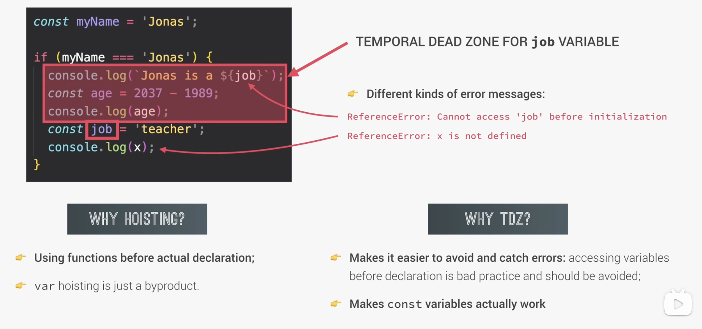
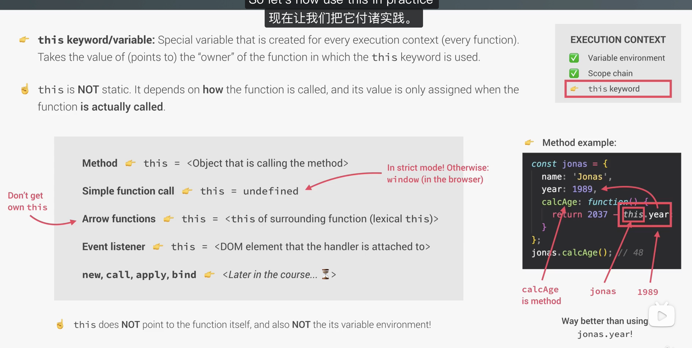
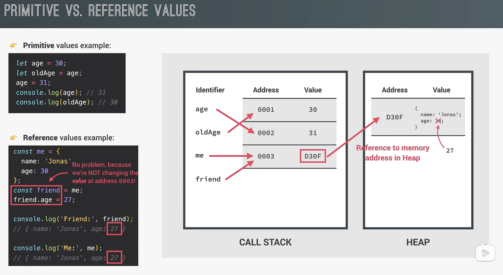
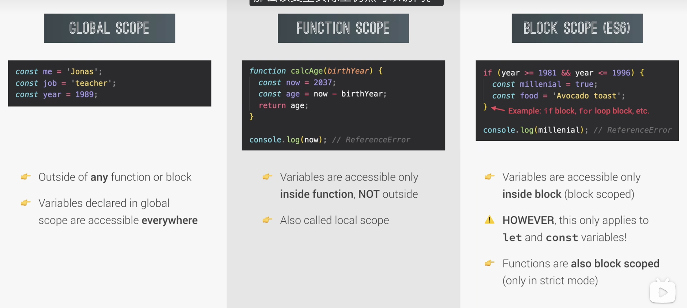
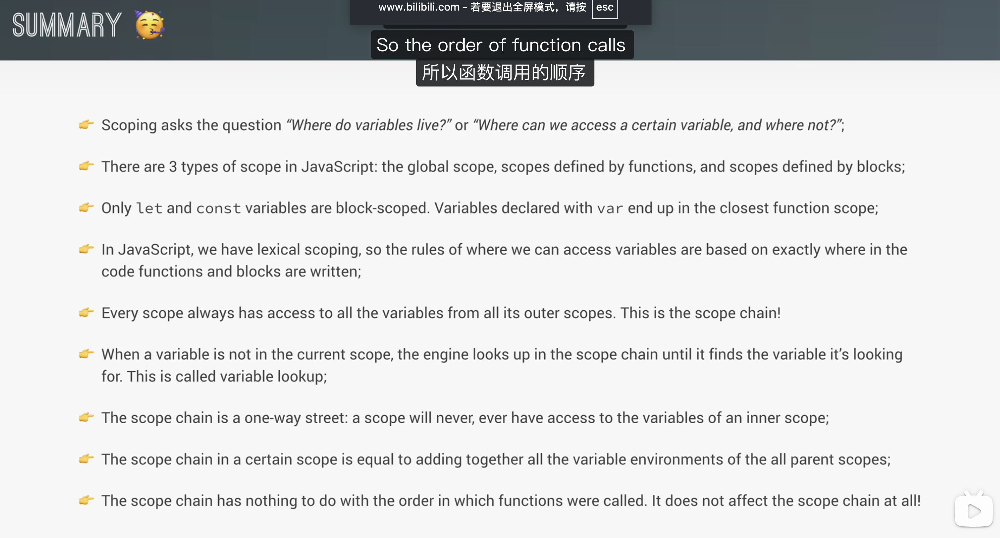

# 06 Scope, Hoisting, and this

## 1.hositing



**hoisting（提升）** 指的是：

> **变量和函数声明在代码执行前，会先被放入作用域中。**

不是

> 代码真的被“搬到上面去了”

而是

> **JavaScript 在执行前的创建阶段，先登记这些声明**

所以“提升”是现象，不是代码移动。

---

二、为什么会有 hoisting

因为执行上下文分两阶段：

1）创建阶段（creation phase）

JS 会先扫描当前作用域，处理：

- 变量声明
- 函数声明
- `this`
- 作用域链

2）执行阶段（execution phase）

才真正一行一行执行代码。

---

三、最重要：不同声明，提升行为不一样

这块是核心。

---

1）函数声明 `function`

会被**完整提升**

```
hello();

function hello() {
  console.log("hi");
}
```

这能正常运行。

因为在创建阶段，JS 已经把整个函数放进去了。

你可以理解成：

```
hello = function hello() { ... }
```

在执行前就可用了。

---

2）`var`

会被提升，但初始值是 `undefined`

```
console.log(a); // undefined
var a = 10;
```

为什么不是报错？

因为创建阶段相当于先做了：

```
a = undefined
```

然后执行阶段才执行：

```
a = 10;
```

所以这段更像：

```
var a;
console.log(a); // undefined
a = 10;
```

---

3）`let` 和 `const`

也会被提升，但**不能在声明前访问**

```
console.log(a);
let a = 10;
```

会报错：

```
ReferenceError
```

这就引出一个新概念：

> **TDZ（Temporal Dead Zone，暂时性死区）**

---

四、什么是 TDZ（暂时性死区）

对于 `let` 和 `const`：

- 变量在创建阶段已经存在了
- 但在真正执行到声明语句之前
- 这个变量处于“不可访问状态”

这段区域就叫：

> **暂时性死区**

---

例子

```
console.log(age); // ReferenceError
let age = 30;
```

不是说 `age` 根本不存在，
而是它还在 TDZ 里，不能碰。

---

`const` 也是一样

```
console.log(name); // ReferenceError
const name = "Jonas";
```

---

五、为什么很多人说 let/const “不提升”

严格来说，这句话不严谨。

更准确地说是：

> **`let` 和 `const` 也会提升，但不会像 `var` 一样初始化为 `undefined`，而是进入 TDZ。**

所以你以后自己做笔记，最好别写：

```
let 和 const 不提升
```

更标准应该写：

```
let 和 const 会提升，但在声明前处于 TDZ，不能访问
```

---

六、函数表达式和箭头函数的提升

这个也很重要，因为你刚学过：

```
const Age2 = function (birthday) { ... };
const Age3 = birthday => ...;
```

它们本质上是：

- 一个变量
- 变量里存了一个函数

所以它们的提升规则不是按“函数声明”算，
而是按变量类型算。

---

1）`var` + 函数表达式

```
console.log(test); // undefined
var test = function () {
  console.log("hi");
};
```

这里 `test` 是 `var`，
所以先提升为 `undefined`。

如果你这样写：

```
test(); // TypeError
var test = function () {
  console.log("hi");
};
```

会报：

```
TypeError: test is not a function
```

因为这时候 `test` 只是 `undefined`，还不是函数。

---

2）`let/const` + 函数表达式 / 箭头函数

```
test(); // ReferenceError
const test = function () {
  console.log("hi");
};
```

或者：

```
add(); // ReferenceError
const add = () => {
  console.log("hi");
};
```

因为 `test` / `add` 在 TDZ 中。

---

十、超短版总结

```txt
function declaration：完整提升
var：提升为 undefined
let / const：提升但在 TDZ 中
```

---

## 2.this关键字



可以，这张图你可以记成一份 **`this` 基础总结笔记**。

#### 1. `this` 是什么

```js
this;
```

`this` 是 JavaScript 在**函数执行时**自动提供的一个特殊变量。

它表示：

> **当前这个函数是“被谁调用的”**

注意两点：

- `this` **不是固定不变的**
- `this` **是在函数真正调用时才确定的**

所以：

> `this` 看“调用方式”，不看“定义位置”

---

#### 2. `this` 属于执行上下文的一部分

一个函数执行时，会创建自己的 **execution context（执行上下文）**，里面通常有：

- Variable environment
- Scope chain
- `this`

所以图右边红框想表达的是：

> 每次函数执行时，JS 都会为它确定一个 `this`

---

#### 3. 不同调用方式下，`this` 的值

---

##### （1）方法调用：`this = 调用该方法的对象`

```js
const jonas = {
  year: 1989,
  calAge: function () {
    console.log(this);
    console.log(this.year);
  },
};

jonas.calAge();
```

这里：

```js
jonas.calAge();
```

是“对象调用方法”，所以：

```js
this === jonas;
```

因此：

```js
this.year;
```

就是：

```js
jonas.year;
```

---

##### （2）普通函数调用：`this = undefined`（严格模式）

```js
function test() {
  console.log(this);
}

test();
```

在 **strict mode** 下：

```js
this === undefined;
```

如果不是严格模式，在浏览器里通常是：

```js
this === window;
```

这个是图里红字写的内容。

---

##### （3）箭头函数：没有自己的 `this`

```js
const test = () => {
  console.log(this);
};
```

箭头函数最重要的一句：

> **箭头函数不创建自己的 `this`**

它会直接使用**外层作用域的 `this`**，这个叫：

```js
lexical this
```

所以图里左边红字写的是：

> Arrow functions don't get own `this`

意思就是：

> 箭头函数没有自己的 `this`

---

##### （4）事件监听函数：`this = 绑定事件的 DOM 元素`

```js
button.addEventListener("click", function () {
  console.log(this);
});
```

这里的 `this` 一般指向：

```js
button;
```

也就是**这个事件处理函数挂载到哪个 DOM 元素上，`this` 就通常指向哪个元素**

---

##### （5）`new / call / apply / bind`

这一块图里只是提到，意思是：

> 这些方式也可以改变或指定 `this`

你现在先记住名字就行，后面单独学。

---

##### 4. 这张图最核心的一句话

> **`this` depends on how the function is called**

也就是：

> `this` 取决于函数是怎么被调用的

不是看函数写在哪，不是看函数属于谁定义的，而是看：

- 是对象调用？
- 是普通函数调用？
- 是箭头函数？
- 是事件回调？
- 是不是用了 `new / call / apply / bind`？

---

##### 5. 图右边例子的意思

```js
const jonas = {
  name: "Jonas",
  year: 1989,
  calAge: function () {
    return 2037 - this.year;
  },
};

jonas.calAge();
```

这里：

- `calAge` 是对象里的一个方法
- `jonas.calAge()` 是方法调用
- 所以 `this` 指向 `jonas`

于是：

```js
this.year;
```

等价于：

```js
jonas.year;
```

结果就是：

```js
2037 - 1989 = 48
```

---

6. 最后一句提醒

图最下面这句很重要：

> `this` does NOT point to the function itself

意思是：

`this` 不是函数本身

比如：

```js
function test() {
  console.log(this);
}
```

这里的 `this` 不是 `test` 这个函数对象。

---

> `this` also NOT its variable environment

意思是：

`this` 也不是它所在的词法环境 / 作用域环境

也就是说：

- `this` 和 **scope** 不是一个东西
- `this` 和 **闭包 / 作用域链** 不是一个判断规则

这个特别容易混。

---

`this` 总结

###### 1. `this` 是什么

- `this` 是函数执行时自动得到的一个特殊变量
- 表示当前函数调用时的“拥有者”
- `this` 在**调用时决定**，不是定义时决定（！！！）

###### 2. `this` 的规则

- **method**：`this = 调用该方法的对象`
- **simple function call**：严格模式下 `this = undefined`
- **arrow function**：没有自己的 `this`，取外层 `this`
- **event listener**：`this = 绑定事件的 DOM 元素`
- **new / call / apply / bind**：可以显式控制 `this`

###### 3. 注意

- `this` **不是函数本身**
- `this` **不是作用域**
- `this` 看**调用方式**
- 箭头函数**没有自己的 `this`**

---

## 3.栈内存与堆内存



## 4.作用域，scope总结笔记





---

#### 1.Scoping 主要回答两个问题：

- **变量存在于哪里**
- **某个位置能不能访问这个变量**

也就是：

> **Where do variables live?**
> **Where can we access a variable?**

---

#### 2. JavaScript 有 3 种作用域

##### ① Global Scope（全局作用域）

最外层定义的变量属于全局作用域。

```js
const name = "Jonas";
```

---

##### ② Function Scope（函数作用域）

在函数内部声明的变量，属于函数作用域。

```js
function test() {
  const age = 20;
}
```

---

##### ③ Block Scope5（块级作用域）

由 `{}` 形成的作用域，比如：

- `if`
- `for`
- `while`

只有 `let` 和 `const` 受块级作用域限制。

```js
if (true) {
  const x = 10;
  let y = 20;
}
```

---

#### 3. `let` / `const 和 `var` 的区别

`let` 和 `const`

是 **块级作用域**

`var`

不是块级作用域，它会归到最近的**函数作用域**

```js
if (true) {
  var a = 1;
  let b = 2;
}

console.log(a); // 1
console.log(b); // 报错
```

---

#### 4. JavaScript 是词法作用域（Lexical Scoping）

这句话很重要：

> **变量的可访问规则，由代码写的位置决定**
> 而不是由运行时调用顺序决定

也就是说：

- 函数写在哪里
- 块写在哪里

这些在代码写出来时，作用域关系就已经确定了。

---

#### 5. 什么是 Scope Chain（作用域链）

每一个作用域都可以访问它外层作用域中的变量。

这就形成了：

> **作用域链**

也就是当前作用域找不到变量时，会沿着外层一层层向上找。

---

#### 6. 什么是变量查找（Variable Lookup）

如果当前作用域没有这个变量，JavaScript 引擎会：

1. 先查当前作用域
2. 没找到就查外层作用域
3. 继续往外查
4. 一直到全局作用域

这个过程叫：

> **variable lookup**

---

#### 7. 作用域链是单向的

这句话也很关键：

> **内层可以访问外层**
> **外层不能访问内层**

也就是说：

- 子作用域可以向外找
- 父作用域永远不能反过来访问子作用域里的局部变量

---

#### 8. 作用域链 ≠ 调用顺序

这个是最容易错的点。

> **作用域链和函数调用顺序没有关系**
> 它只和函数定义的位置有关

所以：

- `call stack` 看谁调用了谁
- `scope chain` 看函数写在哪里

#

```md
## Scope / Scoping / Scope Chain 总结

### 1. Scope

作用域表示变量在代码中的可访问范围。

### 2. JavaScript 中的 3 种作用域

- 全局作用域（Global Scope）
- 函数作用域（Function Scope）
- 块级作用域（Block Scope）

### 3. let / const / var

- let 和 const 是块级作用域
- var 不是块级作用域，而是函数作用域

### 4. Scoping

Scoping 是 JavaScript 管理变量可访问性的规则。

### 5. Lexical Scoping

JavaScript 使用词法作用域：
变量是否可访问，由代码书写位置决定，而不是由函数调用位置决定。

### 6. Scope Chain

每个作用域都能访问外层作用域的变量，这种层层向外的关系叫作用域链。

### 7. Variable Lookup

当前作用域找不到变量时，JavaScript 会沿着作用域链向外查找。

### 8. 单向性

作用域链是单向的：
内层可以访问外层，外层不能访问内层。

### 9. 重要区别

- 调用栈（Call Stack）看函数调用顺序
- 作用域链（Scope Chain）看函数定义位置
```

#

```txt
scope = 变量能在哪访问
scoping = JS 决定访问规则的机制
scope chain = 当前找不到变量时，一层层向外找
```

1. **JavaScript 是词法作用域**
2. **内层作用域可以访问外层变量**
3. **作用域链和函数调用顺序无关，只和定义位置有关**
